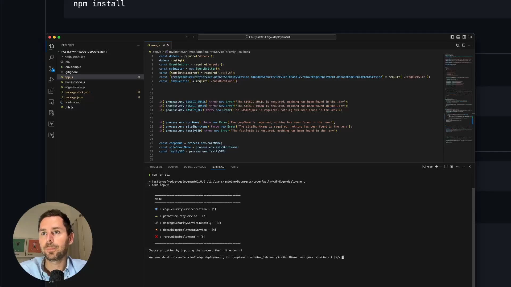

# Fastly WAF @Edge deployement

This CLI tool streamlines the deployment and management of Fastly's Web Application Firewall (WAF) at the edge. It provides a simple and efficient interface to perform key tasks such as creating edge security services, mapping them to Fastly, and managing deployments.

**Video Tutorial :**

[](https://www.youtube.com/watch?v=fhEKAFlmCME)

## Install 

```
npm install
```

## Setup 

Copy the ```.env.sample``` and rename it ```.env``` then fill the informations with your own credentials. 

```
cp .env.sample  .env
```

## Run 

```
npm run cli
```

Then you should get a menu like this if the .env file has been filled correclty. 


```
    -----------------------------------------------------
    Menu
    -----------------------------------------------------

    🌎 : edgeSecurityServiceCreation - [1]

    🔒 : getGetSecurityService - [2]

    🔗 : mapEdgeSecurityServiceToFastly - [3]

    💥 : detachEdgeDeploymentService - [4]

    ❌ : removeEdgeDeployment - [5]

    -----------------------------------------------------
    
Choose an option by inputing the number, then hit enter :    


```

